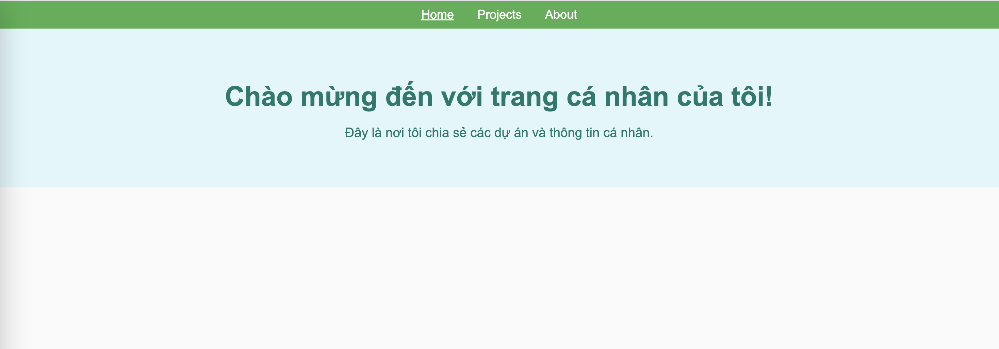

# Log-IP-App

Log-IP-App is a simple web application written in Go that serves static content and logs user IP addresses when they visit the site. The project includes basic HTML pages and CSS styles, and is designed to be deployed on a VPS (Ubuntu).

## Features

- Static file server for HTML and CSS.
- Logs incoming IP addresses for every page visit.
- Simple, lightweight, and easy to deploy.

## Project Structure

```
log-ip-app/
├── access_log.txt        # Logs incoming IP addresses
├── main.go               # Main Go application to run the server
├── static
│   └── style.css         # Stylesheet for the app
└── templates
    ├── about.html        # About page
    ├── index.html        # Homepage
    └── projects.html     # Projects page
```

### Files:

- **main.go**: The main entry point of the application, handles routing and logging.
- **access_log.txt**: A log file that records IP addresses of users visiting the site.
- **static/style.css**: The stylesheet that controls the visual presentation of the pages.
- **templates/**: Contains HTML files for the app's various pages (Home, About, Projects).

## Screenshot

Here’s a screenshot of the app in action:



## Prerequisites

- Go 1.20 or above installed on your system.
- A VPS or local server to deploy the application (Ubuntu recommended).
- Nginx (optional) for reverse proxy configuration.

## Installation

### 1. Clone the repository

Clone the repository to your local machine or server.

```bash
git clone https://github.com/your-username/log-ip-app.git
cd log-ip-app
```

### 2. Install Go

If Go is not installed on your server, you can install it by following these steps:

```bash
wget https://go.dev/dl/go1.20.5.linux-amd64.tar.gz
sudo tar -C /usr/local -xzf go1.20.5.linux-amd64.tar.gz
export PATH=$PATH:/usr/local/go/bin
```

### 3. Build the Go application

Run the following command to build the Go application:

```bash
go build -o log-ip-app main.go
```

### 4. Run the application

After building the app, you can start the server with:

```bash
./log-ip-app
```

By default, the application will run on port 8080. You can access it by navigating to `http://localhost:8080`.

### 5. Deploy with Nginx (optional)

If you want to use Nginx as a reverse proxy to serve the app, follow these steps:

1. Install Nginx:

   ```bash
   sudo apt update
   sudo apt install nginx
   ```

2. Configure Nginx:

   Edit the default site configuration:

   ```bash
   sudo nano /etc/nginx/sites-available/default
   ```

   Add the following configuration:

   ```nginx
   server {
       listen 80;

       server_name your-domain-or-ip;

       location / {
           proxy_pass http://localhost:8080;
           proxy_http_version 1.1;
           proxy_set_header Upgrade $http_upgrade;
           proxy_set_header Connection 'upgrade';
           proxy_set_header Host $host;
           proxy_cache_bypass $http_upgrade;
       }
   }
   ```

3. Restart Nginx:

   ```bash
   sudo systemctl restart nginx
   ```

### 6. Configure firewall (if applicable)

If you're using a firewall, make sure the required ports (80 and 8080) are open:

```bash
sudo ufw allow 80/tcp
sudo ufw allow 8080/tcp
sudo ufw enable
```

## Accessing the App

Once the application is running, you can access it via:

```
http://your-vps-ip/    # If you used Nginx as a reverse proxy
or
http://localhost:8080  # If you ran the app directly
```

## License

This project is open-source and available under the [MIT License](LICENSE).
